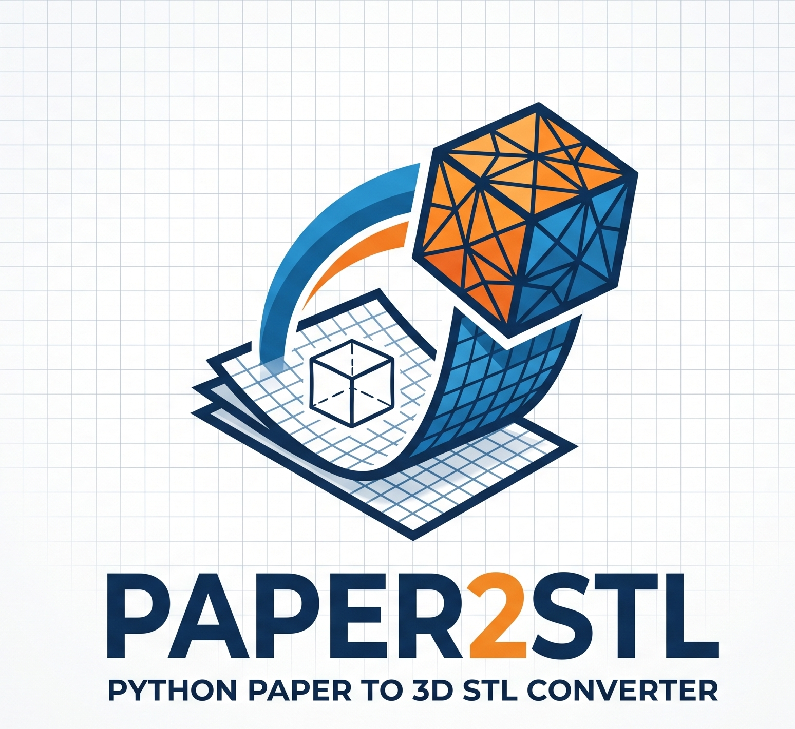
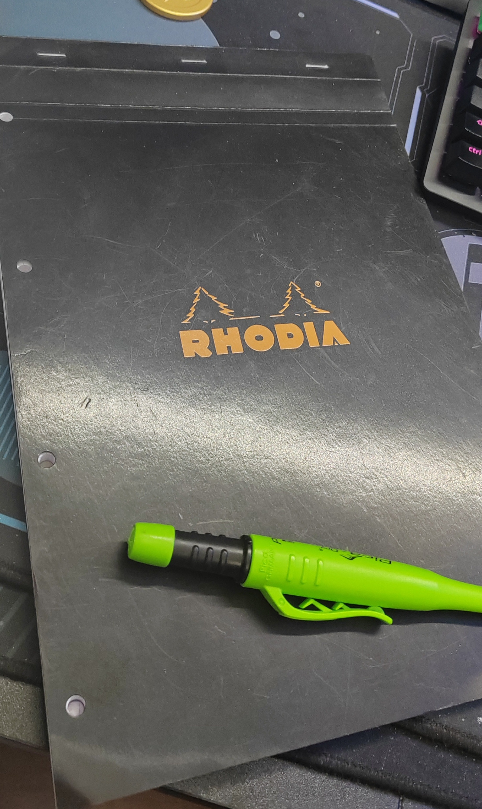
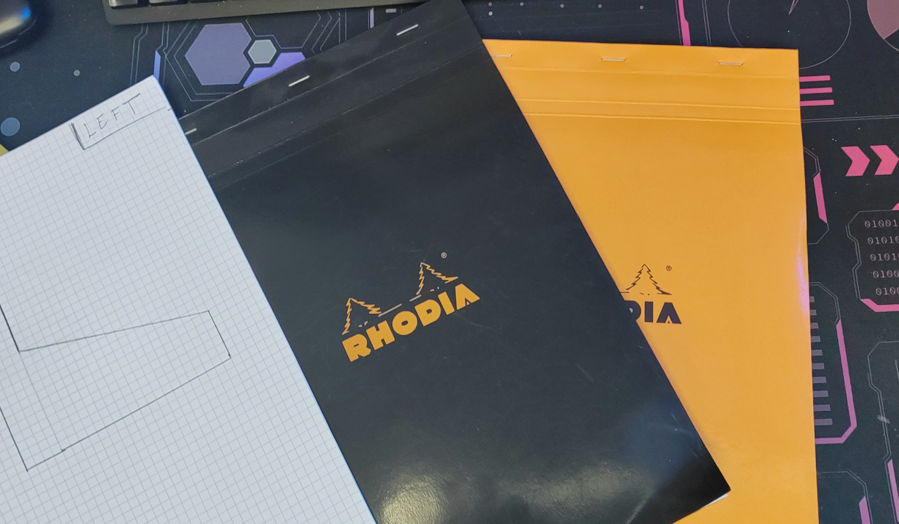
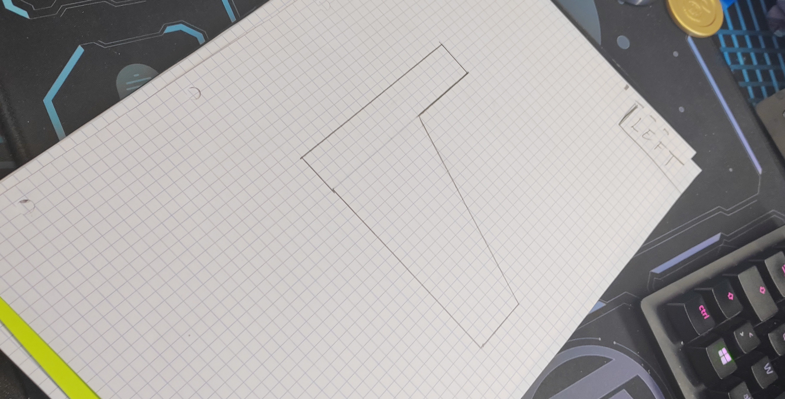
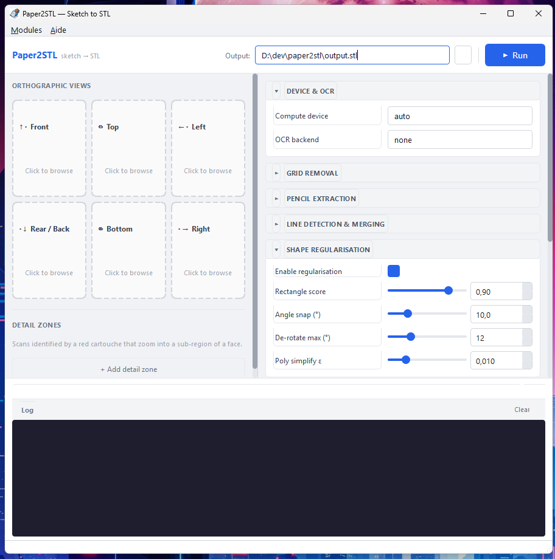

# Paper2STL — du croquis au STL

> 🇬🇧 **English version**: follow this link → [**README.md**](README.md).



Reconstruisez un solide **`.stl` étanche (watertight)** à partir de **croquis
orthographiques au crayon, scannés**, dessinés sur du papier quadrillé.

---

## 🧩 Vue d'ensemble

Dessinez une pièce à la main — une vue orthographique par feuille (*dessus,
face, dessous, arrière, gauche, droite*) —, scannez les pages, et Paper2STL les
transforme en un modèle 3D imprimable.

En coulisses, le programme lit le dossier de scans, supprime le quadrillage
imprimé, vectorise les traits de crayon, identifie de quelle vue il s'agit pour
chaque page, reconstruit un volume 3D à partir des silhouettes, complète les
vues manquantes, applique les détails de **pages de détail** marqués par des
cadres rouges, puis écrit un STL.

```
scans/ ──► [A] prétraitement ──► [B] métadonnées ──► [C] reconstruction ──► [D] export ──► model.stl
```

### Pour de meilleurs résultats
On peut se servir de n'importe quel papier pour utiliser cette application, mais j'ai remarqué que j'étais plus à l'aise et que j'obtenais de meilleurs résultats avec du papier quadrillé (millimétré ou centimétré) et un crayon à mine dure (HB ou 2H). Le quadrillage imprimé est automatiquement supprimé, et les traits de crayon sont plus faciles à vectoriser lorsqu'ils sont fins et contrastés. J'utilise depuis des années des carnets RODHIA et avec j'obtiens des resultats très satisfaisants pour mes usages personnels.

<p>
  
  
  
</p>


### Contribuer au projet
Vous pouvez contribuer au projet en proposant des améliorations, en signalant des bugs, ou en ajoutant de nouvelles fonctionnalités. N'hésitez pas à ouvrir une issue sur GitHub ou à soumettre une pull request. Pour les développeurs, le code est écrit en Python 3.10+ et utilise des bibliothèques populaires comme NumPy, OpenCV, scikit-image, trimesh et PySide6. Les contributions sont les bienvenues !

### Comment ça marche

Il y a **deux façons de l'utiliser**, choisissez la vôtre :

| | [🚀 Mode Facile](#-mode-facile) | [🐍 Mode Pro](#-mode-pro) |
|---|---|---|
| **Pour** | tout le monde | les personnes à l'aise avec Python |
| **Comment** | télécharger l'app, cliquer | ligne de commande + install depuis les sources |
| **Nécessite** | Python 3.10+ | Python 3.10+, un terminal |
| **Vous donne** | l'interface graphique | toutes les options réglables + l'API |

> 📖 Quel que soit le mode choisi, le [**USER_MANUAL.md**](USER_MANUAL.md)
> explique *comment dessiner*, combien de feuilles scanner, et ce que chaque
> paramètre change sur le STL généré.

> 🤖 **Avertissement IA.** Ce projet a été réalisé avec l'aide de Claude et
> Copilot pour écrire/refactoriser le code et rédiger la documentation. Toutes
> les idées, décisions de conception et le code final sont l'œuvre de l'auteur —
> l'IA a été utilisée comme un outil.

---

## 🚀 Mode Facile

**Pas de Python. Pas de ligne de commande. Téléchargez, cliquez, et déposez vos
scans.**

### 1 — Récupérer l'application

Récupérez l'archive préconstruite sur la [**page des Releases**](../../releases) :

- **macOS** → `Paper2STL-mac.zip`
- **Windows** → `Paper2STL-windows.zip`

Le téléchargement est minuscule (quelques Mo — uniquement le code source). Au
premier lancement, l'application installe discrètement tout ce dont elle a
besoin (~400 Mo, une seule fois), puis démarre toute seule. Chaque lancement
suivant est instantané.

> L'application est **entièrement portable** : tout se trouve à côté du
> lanceur. Supprimez le dossier et il ne reste rien — rien n'est jamais écrit
> dans votre profil utilisateur ni dans le registre.


### 2 — Utiliser l'interface graphique



1. **Déposez un scan sur chaque carte de face** à gauche (*Front / face, Top /
   dessus, Left / gauche, Rear-Back / arrière, Bottom / dessous, Right /
   droite*) — ou cliquez sur une carte pour parcourir vos fichiers. Vous n'avez
   pas besoin des six : les vues manquantes sont déduites.
2. *(Optionnel)* ajoutez une **zone de détail** (Detail zone) pour les scans
   marqués d'un cartouche rouge qui zooment sur une sous-partie d'une face.
3. Renseignez le chemin de **sortie** (Output, en haut à droite) — le chemin
   complet du `.stl` à écrire.
4. Ajustez ce que vous voulez dans le **panneau de paramètres** à droite (tout
   est repliable) : *Device & OCR, Grid removal, Pencil extraction, Line
   detection & merging, Shape regularisation, …*. Les valeurs par défaut
   fonctionnent telles quelles, vous pouvez donc ignorer cette partie.
5. Cliquez sur **▶ Run** (ou `Ctrl+R`). La progression et un journal en direct
   s'affichent en bas.

### Modules optionnels

L'application installe uniquement le **cœur** (léger). Si vous souhaitez les
extras — **PyTorch** (complétion de forme par réseau de neurones) ou **OCR**
(lecture de l'étiquette de vue dans le cartouche, pour que les scans n'aient pas
à s'appeler `front.jpg`, `top.jpg`, …) — ouvrez le menu **Modules**. Il détecte
votre système et votre GPU et lance la bonne commande d'installation pour vous.
Pas de reconstruction, pas de terminal.

### À propos / réinitialiser

- **Aide ▸ À propos…** affiche la version, l'auteur et la licence.
- Pour repartir de zéro, supprimez simplement le dossier de l'application et
  réextrayez le téléchargement.

---

## 🐍 Mode Pro

**Pour les développeurs.** Nécessite des compétences en Python, un terminal et
Python 3.10+. Ce mode vous donne accès à toute la ligne de commande, à chaque
paramètre réglable et à l'API Python.

### Installer depuis les sources

```bash
git clone https://www.github.com/clem2k/paper2stl && cd paper2stl
python3 -m venv .venv && source .venv/bin/activate
pip install -e .                 # cœur uniquement — l'interface fonctionne entièrement ainsi
```

Le **cœur** (numpy, OpenCV, scikit-image, trimesh, PySide6) tourne sur CPU sans
aucun modèle. Les extras lourds, optionnels, s'installent à la demande :

- **OCR** (`easyocr` *ou* `pytesseract`) — lit le mot-clé de vue dans le
  cartouche. Sans lui, le pipeline se rabat sur le **nom de fichier**
  (`front.jpg`, `top.jpg`, …).
- **PyTorch** — nécessaire uniquement pour le redressement de lignes ou la
  complétion 3D par réseau de neurones.

Ajoutez-les avec `pip install ".[neural,ocr]"`, ou plus tard depuis le menu
**Modules** de l'interface.

### Démarrage rapide

Un exemple prêt à l'emploi (la pièce *flipper*, 6 vues) est inclus dans le dépôt
— aucun modèle requis :

```bash
python -m paper2stl examples/flipper -o out.stl -v
# ✓ STL written to out.stl   (watertight)
```

Ou lancez la même interface graphique que le Mode Facile :

```bash
python -m paper2stl --gui         # ou : paper2stl-gui
```

### Ligne de commande

```
python -m paper2stl INPUT_DIR [-o OUT.stl] [options]
```

| Option | Défaut | Effet |
|---|---|---|
| `-o, --output FILE` | `output.stl` | chemin du STL de sortie |
| `-c, --config FILE` | — | config YAML (voir [`config/default.yaml`](config/default.yaml)) |
| `--device {cuda,mps,cpu}` | auto | force le périphérique de calcul |
| `--resolution N` | 256 | résolution de la grille de voxels sur le plus grand axe |
| `--size-mm N` | — | redimensionne la plus grande dimension à N millimètres |
| `--no-fill-missing` | off | désactive le miroir des vues opposées manquantes |
| `--neural-weights FILE` | — | active la complétion neuronale contrainte par reprojection |
| `--no-align` | off | désactive le recalage inter-vues (utilise crop-and-stretch à la place) |
| `--align-tolerance FRAC` | 0.15 | de combien une vue peut être décalée pour se recaler (fraction de la longueur de l'axe) ; 0 désactive la recherche de décalage |
| `--ocr-backend {auto,easyocr,tesseract,none}` | auto | moteur OCR d'étiquette de vue ; `none` classe par nom de fichier uniquement (bien plus rapide) |
| `--grid-tolerance N` | 0.0 | tolérance de suppression du quadrillage ; négatif = plus strict, positif = plus agressif |
| `--pencil-strength N` | 55 | seuil de contraste de l'encre — à quel point un trait doit être plus sombre que le papier ; `0` = ancien seuillage adaptatif |
| `--straighten-pct PCT` | 100 | redressement des lignes 0–100 ; `100` = entièrement droit (refit TLS), `0` = extrémités Hough brutes (conserve les courbes) |
| `--no-regularize` | off | conserve le contour dessiné à la main au lieu de l'aligner sur des rectangles/arêtes nets |
| `--rect-score FRAC` | 0.90 | seuil de « rectangularité » 0–1 : une silhouette remplissant au moins cette fraction de son rectangle englobant est ramenée à un rectangle parfait |
| `--angle-snap-deg DEG` | 10 | aligne sur l'horizontale/verticale les arêtes de silhouette à moins de tant de degrés d'un axe dominant |
| `--presmooth-sigma SIGMA` | 0.6 | pré-lissage gaussien (en voxels) avant les marching cubes ; `0` le désactive |
| `--debug-dir DIR` | — | enregistre les images de debug par page (suppression du quadrillage, traits binarisés, segments, silhouette) en JPEG |
| `-v / -vv` | — | verbosité |
| `--info` | — | affiche le périphérique de calcul détecté et quitte |
| `--gui` | — | lance l'interface graphique |

Les scans peuvent être nommés par vue (`front.jpg`) ou porter le mot-clé dans le
cartouche en haut à droite ; les termes anglais et français courants sont
reconnus (*face, dessus, gauche, …*).

### Accélération matérielle

Tout composant d'apprentissage profond choisit le périphérique dynamiquement :

```
CUDA (Nvidia) > MPS (Apple Silicon) > CPU
```

Vérifiez ce qui a été détecté :

```bash
python -m paper2stl --info        # ex. "compute device = mps (Apple Silicon GPU)"
```

### Pourquoi une enveloppe visuelle par voxels (et la gestion des vues manquantes)

Les silhouettes orthographiques ne contraignent qu'une **enveloppe visuelle**
(*visual hull*) : l'intersection des prismes obtenus en extrudant chaque
silhouette le long de son axe de vue. C'est exact et fidèle dimensionnellement
pour les directions observées et — parce qu'on travaille dans une **grille de
voxels** maillée par **marching cubes** — le résultat est une **variété fermée
par construction** (pas de fragiles opérations booléennes sur maillage).

Les vues manquantes sont comblées par une cascade de a priori, du plus fort au
plus faible :

| Couche | Rôle | Déclencheur |
|---|---|---|
| **Enveloppe visuelle par voxels** | cœur exact et étanche | toujours |
| **Symétrie de vue opposée** | miroir `gauche`→`droite`, `dessus`→`dessous`, … | vue opposée absente |
| **Extrusion bornée** | une vue isolée devient une dalle finie, pas un prisme infini | un axe observé par aucune vue |
| **Complétion neuronale** *(optionnelle)* | a priori de forme appris, **reprojeté sous les silhouettes observées** pour ne jamais les violer | `--neural-weights` |

Le modèle neuronal ne *remplace* jamais l'enveloppe — sa sortie est réintersectée
avec chaque silhouette observée, préservant la cohérence dimensionnelle.

### Utilisation programmatique

```python
from paper2stl import Pipeline, PipelineConfig

cfg = PipelineConfig()
cfg.reconstruction.voxel_resolution = 160
cfg.export.target_size_mm = 100            # taille physique de la plus grande arête

Pipeline(cfg).run("examples/flipper", "model.stl")
```

Vous avez déjà des silhouettes propres ? Sautez le prétraitement/OCR :

```python
from paper2stl import Pipeline
sil = {"front": front_mask, "top": top_mask, "right": right_mask}  # uint8 0/255
Pipeline().run_on_silhouettes(sil, "model.stl")
```

### Architecture

```
paper2stl/
├── cli.py / __main__.py        # point d'entrée ligne de commande
├── config.py                   # config typée (chargeable depuis YAML)
├── device.py                   # résolveur CUDA / MPS / CPU
├── pipeline.py                 # orchestrateur (dossier de scans → STL)
│
├── preprocessing/              # [A]
│   ├── grid_removal.py         #   masque couleur HSV + inpaint
│   ├── binarize.py             #   CLAHE + seuillage adaptatif → traits de crayon
│   ├── vectorize.py            #   Hough + refit TLS → segments + silhouette
│   └── regularize.py           #   aligne les silhouettes sur rectangles / axes nets
│
├── metadata/                   # [B]
│   ├── ocr.py                  #   OCR du cartouche → classification de vue (floue)
│   └── red_frames.py           #   détection de cadre rouge + OCR intérieur (réf. détails)
│
├── reconstruction/             # [C]
│   ├── views.py                #   convention d'axes image→3D, vues opposées
│   ├── align.py                #   recalage sur axe partagé → boîte englobante de voxels
│   ├── csg_recon.py            #   extrusion + intersection → enveloppe visuelle voxel
│   ├── infer_missing.py        #   miroir de vue opposée, axes non contraints
│   ├── neural_recon.py         #   complétion U-Net 3D optionnelle (contrainte par reprojection)
│   └── reconstruct.py          #   orchestration de l'étape C
│
├── detail_pages/
│   └── apply_details.py        #   applique les détails en CSG local (poche/bossage)
│
├── export/                     # [D]
│   └── mesh_export.py          #   marching cubes → lissage de Taubin → réparation → STL
│
├── gui/                        # interface bureau PySide6 (+ installeur de Modules)
└── utils/                      # utilitaires io + géométrie

config/default.yaml             # tous les réglages
examples/flipper/               # scans de démo prêts à l'emploi (6 vues)
tests/                          # tests du pipeline cœur (sans OCR/torch)
```

### Tests

```bash
pip install -e ".[dev]"
python -m pytest tests/ -q
```

Les tests couvrent la convention d'axes, le creusage de l'enveloppe visuelle, la
déduction des vues manquantes et l'export étanche — et s'exécutent **sans** OCR
ni PyTorch installés.

### Limitations & pistes

- L'enveloppe visuelle ne peut pas récupérer les concavités invisibles depuis
  toutes les silhouettes (par ex. une cavité entièrement interne). Activez la
  complétion neuronale, ou modélisez ces détails explicitement en pages de
  détail.
- Les traits dessinés en perspective/oblique sont supposés déjà orthographiques ;
  un analyseur de fil de fer appris peut se brancher dans
  `preprocessing/vectorize.py`.
- Le placement des pages de détail associe actuellement un scan référencé à une
  poche/un bossage à l'emplacement du cadre rouge ; une sémantique de détail plus
  riche peut étendre `DetailPage`.

---

## Licence

MIT — voir [LICENCE](LICENCE).
