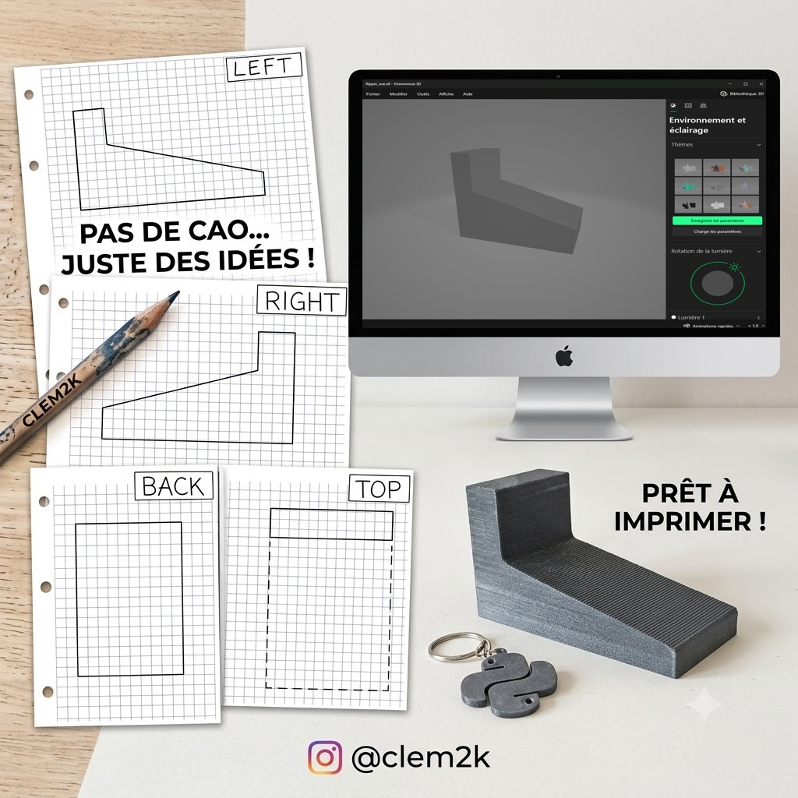

# Paper2STL — User Manual



> **No CAD… just ideas!** Sketch your part in pencil on grid
> paper, scan (or photograph) each view, and Paper2STL reconstructs a
> watertight `.stl` file, ready to print.

This guide explains **how to draw**, **how many sheets** are needed
for a good result, then details **each parameter** and its effect on the
generated STL.

---

## 1. The principle in one sentence

You draw the **orthographic views** (front, top, side…) of your object,
just like on a technical drawing. The software traces each silhouette,
**extrudes** them and **intersects** them in 3D ("visual hull") to recover the
volume, then exports it as STL.

```
drawn sheets ──► grid removal ──► vectorisation ──► 3D volume ──► model.stl
```

---

## 2. How to draw

### 2.1 The medium

- Use **grid paper** (small blue/purple squares). The printed grid
  is automatically **removed**: it only serves as a guide to help you
  keep correct proportions and right angles.
- One **sheet = a single view** of the object. Do not mix two views on the same
  page.
- Draw with a **pencil** or a **dark** pen. The stroke must be clearly
  darker than the grid.

### 2.2 Drawing conventions

| Element | How to draw it | Meaning |
|---|---|---|
| **Visible edge** | Continuous **solid** line | The actual border of this view's silhouette |
| **Hidden edge** | **Dotted / dashed** line | A contour located behind, not visible on this face |
| **Title block** | Small frame at the **top right** with the view name | Identifies the view (see §2.4) |

> In the logo example: the *TOP* view has a solid rectangle (the actual top of the
> part) and a large dashed area (the base, hidden from the top view). This is
> exactly what makes it possible to reconstruct the "L"-shaped step.

### 2.3 Best practices for a clean result

- **Close your contours**: each silhouette must form a closed polygon.
- **Follow the grid lines** for horizontal/vertical edges. Flat
  faces then produce flat faces in the STL (regularisation
  automatically straightens small hand tremors).
- **Keep proportions consistent across views**: if the part is 6 squares wide
  in the *front* view, it must be 6 squares wide in the *top* view. The
  software realigns the views with each other, but consistent proportions
  guarantee a correct volume.
- **Center** your drawing on the sheet, without sticking it to the edges.
- Avoid shadows, scribbles and annotations in the drawing area.

### 2.4 The title block (view name)

Draw a small frame at the **top right** of each sheet and write in it the
view name. If OCR is active, the name is read automatically; otherwise, **name the
file** after the view (`front.jpg`, `top.jpg`, …).

Recognised names (English **and** French):

| View | Accepted keywords | File name |
|---|---|---|
| Front | `front`, `face`, `avant` | `front.jpg` |
| Rear | `rear`, `back`, `arriere`, `dos` | `rear.jpg` |
| Top | `top`, `dessus`, `haut`, `plan` | `top.jpg` |
| Bottom | `bottom`, `dessous`, `bas` | `bottom.jpg` |
| Left | `left`, `gauche` | `left.jpg` |
| Right | `right`, `droite`, `droit` | `right.jpg` |

---

## 3. How many sheets to draw?

The number of views determines the **fidelity** of the reconstruction. The more
you provide, the less the software has to "guess".

| No. of views | Expected result | When to use it |
|---|---|---|
| **1 view** | Simple **extrusion**: the silhouette is pulled to a finite thickness. Produces a "flat / prismatic" object. | Extruded parts (plates, profiles) |
| **2–3 views** | **Recommended for most parts.** With *front*, *top* and one side, the volume is almost fully constrained. Missing opposite views are inferred by **symmetry**. | General case (e.g. the L-bracket in the logo) |
| **6 views** | **Maximum fidelity.** *front, rear, top, bottom, left, right*: no face is guessed. | Asymmetric or complex parts |

### Practical rules

- **Useful minimum: 2 views** that are not parallel (e.g. *front* + *top*). A single view can
  only produce an extrusion.
- **For comfort: 3 views** (*front*, *top*, *left* or *right*). This is the best
  effort/quality ratio, and it is what the logo example illustrates.
- Provide the **opposite view** only if the part is **not symmetric** on
  that axis. Otherwise, let the software infer it by mirroring (option *Fill missing
  views*).
- The **order of the sheets does not matter**: it is the title block / file
  name that determines the view, not the position.

### Detail sheets (optional)

In addition to the 6 main views, you can add **detail sheets**
to engrave or add material locally (pocket, boss, engraving):

1. On a **main view**, frame the area concerned with a **red box**.
2. On a **separate sheet**, redraw the pattern of this detail at a larger scale.
3. In the interface, add it via **"+ Add detail zone"** (or place it in the
   scans folder with its red box).

The pattern is then projected onto the target face and:

- **subtracted** → creates a **pocket / engraving** (`pocket` mode, default);
- **added** → creates a **boss / relief** (`boss` mode).

Detail sheets are **optional**: without them, you get the general
shape; with them, you add the finishing touches. They do not influence the
overall silhouette, only the local material at the indicated depth.

---

## 4. Parameters and their effect on the STL

The parameters are grouped by section (same names as in the graphical
interface). For most drawings, **the default values are enough**:
only change them if the result is not satisfactory.

### 4.1 Device & OCR

| Parameter | Effect | When to adjust it |
|---|---|---|
| **Compute device** | Choice of processor (CPU / GPU CUDA / MPS) for the neural components. `auto` picks the best. | Only impacts speed, not the shape of the STL. |
| **OCR backend** | Reads the view name from the title block. `none` = the fastest, classifies views by **file name**. | Set to `auto` if your files are not named by view. |

> **OCR and GPU acceleration require the optional modules** (EasyOCR/Tesseract,
> PyTorch). Install them in one click from the app's **Modules** menu — see
> [INSTALL.md](INSTALL.md#optional-modules). Without them, leave *OCR backend* on
> `none` (views are recognised by file name) and *Compute device* on `cpu`.

### 4.2 Grid Removal

Controls the erasing of the grid paper before vectorisation.

| Parameter | Effect on the STL | Setting |
|---|---|---|
| **Tolerance** | Aggressiveness of the cleaning. `+1` erases more grid; `-1` leaves more. | Increase if a residual grid creates noise; decrease if your **pencil strokes disappear**. |
| **Min saturation** | Color threshold above which a pixel is considered "grid". | Lower for a very pale grid. |
| **Max brightness** | Only areas brighter than this threshold are erased. Protects dark strokes. | Lower if the grid is dark; keep ≥ 180 to avoid eating into the pencil. |

> Bad setting = holed or noisy silhouette → irregular edges on the STL.

### 4.3 Pencil Extraction

Isolates the pencil stroke from the paper background.

| Parameter | Effect on the STL | Setting |
|---|---|---|
| **Min contrast (strength)** | How much darker than the paper a pixel must be to count as a stroke. High = rejects the grid but may lose pale strokes. | Lower if your light strokes (especially **dotted lines**) are ignored. `0` = old adaptive method. |
| **Background kernel (px)** | Size of the paper-background estimation window. | Increase on scans with uneven lighting. |
| **Adaptive block size** | Window of the adaptive thresholding (legacy method, if strength = 0, odd). | Rarely useful. |
| **Adaptive bias C** | Bias of the adaptive thresholding (legacy method). | Rarely useful. |

### 4.4 Line Detection & Merging

Turns strokes into straight segments; notably handles **dotted lines**.

| Parameter | Effect on the STL | Setting |
|---|---|---|
| **Hough threshold** | Line detection sensitivity. Low = detects more, but more noise. | Lower if edges are missing; raise if spurious lines appear. |
| **Min line length (px)** | Minimum length of a detected segment. | **Lower** to capture **short dashes**. |
| **Max dash gap (px)** | Largest gap between dashes still merged into a single line. | **Increase** to reconnect **dotted hidden edges** that are too far apart. |
| **Merge angle (°)** | Two segments with close angles are merged into one. | Increase slightly if an edge fragments into several pieces. |
| **Merge distance (px)** | Max perpendicular distance to merge two aligned segments. | Same: reconnects the segments of a single edge. |
| **Straighten %** | Straightening of the lines. `100` = perfectly straight; `0` = keeps curves/tremors. | Lower if your part has **intentionally curved edges**. |

### 4.5 Shape Regularisation

Cleans the **filled silhouette** to eliminate the wobbles of freehand
strokes — this is what turns a "shaky" rectangle into a perfect rectangle.

| Parameter | Effect on the STL | Setting |
|---|---|---|
| **Enable regularisation** | Enables/disables all geometric cleaning. | Leave enabled; disable only for organic shapes. |
| **Rectangle score** | "Rectangularity rate" above which a shape becomes a **perfect rectangle**. `0.90` = anything 90% similar to a rectangle becomes one. | Lower to force approximate shapes into rectangles; raise to preserve slight offsets. |
| **Angle snap (°)** | Edges close to a dominant axis are aligned exactly onto it. | Raise to straighten more strongly; lower to **preserve genuine slopes**. |
| **De-rotate max (°)** | Corrects a **crookedly scanned sheet** up to this angle. Beyond it, the rotation is considered intentional. | Increase if your scans are tilted; lower if a rotation is **intentional**. |
| **Poly simplify ε** | Polygon simplification (fraction of the perimeter). High = fewer vertices. | Raise to smooth very noisy contours. |

### 4.6 Reconstruction (3D volume)

Core of the reconstruction: from silhouettes to the voxelised volume.

| Parameter | Effect on the STL | Setting |
|---|---|---|
| **Voxel resolution** | Fineness of the 3D grid (cells on the largest axis). High = more detail, heavier file, longer computation. | `256` by default. Raise for small details; lower for a quick preview. |
| **Fill missing views** | Infers absent views (mirror of the opposite view, extrusion of a single view). | Leave enabled unless you want **strictly** what you drew. |
| **Extrude depth (frac)** | Depth given to a **single** view (fraction of its size). | Increase for a "thicker" object when only one view is provided. |
| **Align views** | Realigns views drawn at different positions on the sheets. | Leave enabled: compensates for imperfect centering. |
| **Align tolerance** | Amount of registration allowed between sheets (fraction of the axis). `0` = no offset. | Increase if your drawings are poorly centered from one sheet to the next; lower to trust the drawn position. |
| **Marching cubes level** | Surface extraction threshold (0–1). `0.5` standard. | Rarely touch: `>0.5` thins the part, `<0.5` thickens it slightly. |
| **Taubin smoothing** | Mesh smoothing iterations (preserves volume). | Raise to soften the staircase steps; `0` for very sharp raw edges. |

### 4.7 Export (STL output)

| Parameter | Effect on the STL | Setting |
|---|---|---|
| **Target size (mm)** | Scales the part so that its **largest dimension** is this size in mm. | **Set it** to get a part with the **correct print dimensions** (e.g. `100`). Empty = raw voxel units. |
| **Binary STL** | Binary (compact) STL rather than ASCII. | Leave enabled (lighter file). |
| **Ensure watertight** | Repair pass: closes holes, fixes normals. | Leave enabled for a guaranteed **printable** STL. |
| **Pre-smooth σ (voxels)** | Light blur of the grid before meshing: removes the voxel "staircase" effect on flat faces without rounding the corners. | `0.6` by default. Raise a bit for smoother faces; `0` to keep every voxel. |

### 4.8 Debug Output (optional)

| Parameter | Effect | Usage |
|---|---|---|
| **Debug image folder** | Saves 5 images per view (grid removed, binary, segments, raw silhouette, regularised silhouette). | Essential to **diagnose** a bad result: you can see at which step it goes wrong. |

---

## 5. Quick start

### Graphical interface

```bash
python -m paper2stl --gui
```

1. Drag and drop each scan into its zone (*front*, *top*, *left*, …).
2. (Optional) Add **detail zones**.
3. Adjust the parameters if needed (otherwise leave the default values).
4. Run the reconstruction and export the `.stl`.

### Command line

```bash
python -m paper2stl SCANS_FOLDER -o model.stl --size-mm 100 -v
```

---

## 6. Quick troubleshooting

| Symptom | Likely cause | Solution |
|---|---|---|
| Hidden edges ignored | Dotted lines too pale or too far apart | Lower *Min contrast*, *Min line length*; raise *Max dash gap* |
| Wavy faces | Shaky stroke not regularised | Check *Enable regularisation*, raise *Rectangle score* |
| Noisy / holed silhouette | Grid poorly removed | Adjust *Tolerance*, *Min saturation* (Grid Removal section) |
| Part too thin / too thick | Single view, or wrong *Marching cubes level* | Add a view, or adjust *Extrude depth* |
| Wrong dimensions | Scale not set | Fill in *Target size (mm)* |
| Tilted part | Crooked scan | Raise *De-rotate max* |

---

*Paper2STL — © @clem2k. No CAD… just ideas, ready to print!*
